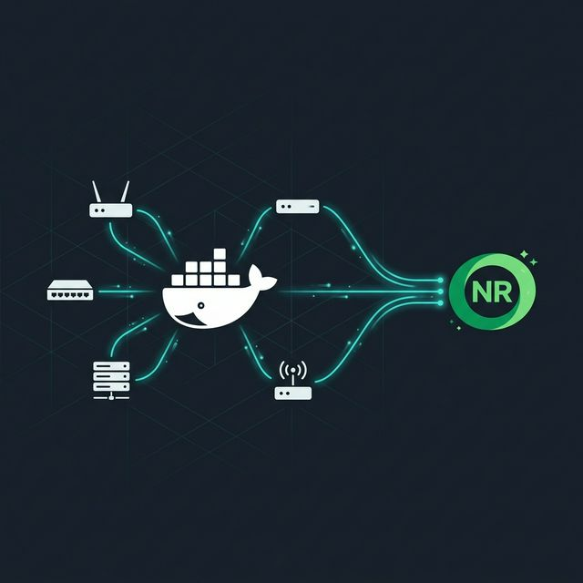

# New Relic Network Monitoring Demo

A containerized lab for simulating multi-vendor network telemetry and shipping it to New Relic. Five SNMP-simulated devices, plus custom trap and syslog generators, all wired together with Docker Compose.



## What's Inside

| Component | Description |
|---|---|
| `snmp-record/` | Pre-recorded SNMP walk data for 5 device profiles |
| `network-trap-simulator/` | Python-based SNMPv2c trap generator with incident scenarios |
| `network-syslog-simulator/` | Python-based RFC 3164 syslog generator with correlated events |
| `docker-compose.yml` | One-click deployment of all simulators and ktranslate receivers |
| `architecture-diagram.drawio` | Editable architecture diagram |
| `medium.md` | Full tutorial article |

## Simulated Devices

| Device | IP Address | Profile |
|---|---|---|
| Cisco Router | 10.10.0.10 | IOS system & interface metrics |
| Cisco Switch | 10.10.0.11 | Layer 2/3 switching telemetry |
| Linksys Router | 10.10.0.12 | Consumer gateway simulation |
| Linux Server | 10.10.0.13 | UCD-SNMP application server |
| MikroTik Router | 10.10.0.14 | RB750Gr3 multi-vendor showcase |

## Prerequisites

- Docker and Docker Compose
- A [New Relic](https://newrelic.com/) account (free tier works)
- Your New Relic **License Key** and **Account ID**

## Quick Start

1. **Clone the repo**

   ```bash
   git clone https://github.com/avecenabasuni/newrelic-npm-showcase.git
   cd newrelic-npm-showcase
   ```

2. **Create a `.env` file** in the project root

   ```env
   NR_LICENSE_KEY=your_license_key_here
   NR_ACCOUNT_ID=your_account_id_here
   ```

3. **Bring everything up**

   ```bash
   docker compose up -d
   ```

   This starts all 5 SNMP simulators, 4 ktranslate receivers (SNMP, Traps, Syslog, NetFlow), and the trap/syslog/flow generators.

4. **Check New Relic** -- metrics should appear within a few minutes under Network Monitoring.

## Tearing Down

```bash
docker compose down -v
```

## Project Structure

```
.
├── docker-compose.yml
├── snmp-record/
│   ├── cisco-router/public.snmprec
│   ├── cisco-switch/public.snmprec
│   ├── linksys-router/public.snmprec
│   ├── linux-server/public.snmprec
│   └── mikrotik-router/public.snmprec
├── network-trap-simulator/
│   ├── Dockerfile
│   ├── generate.py
│   └── README.md
├── network-syslog-simulator/
│   ├── Dockerfile
│   ├── generate.py
│   └── README.md
├── images/
│   └── thumbnail.png
├── architecture-diagram.drawio
└── medium.md
```

## Full Tutorial

The step-by-step walkthrough is in [`my Medium article`](https://avecenabasuni.medium.com/new-relic-network-monitoring-a-complete-tutorial-without-physical-devices-14cc515077e8). It covers SNMP polling, trap ingestion, syslog forwarding, and NetFlow collection from scratch.

## Acknowledgments

- [Kentik ktranslate](https://github.com/kentik/ktranslate) for the SNMP/trap/syslog/flow receiver
- [snmpsim](https://github.com/tandrup/docker-snmpsim) for SNMP device simulation
- [nflow-generator](https://github.com/nerdalert/nflow-generator) for NetFlow v5 traffic

## License

This project is provided as-is for educational and demonstration purposes.
